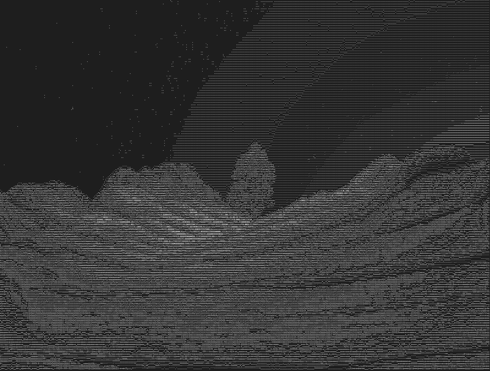
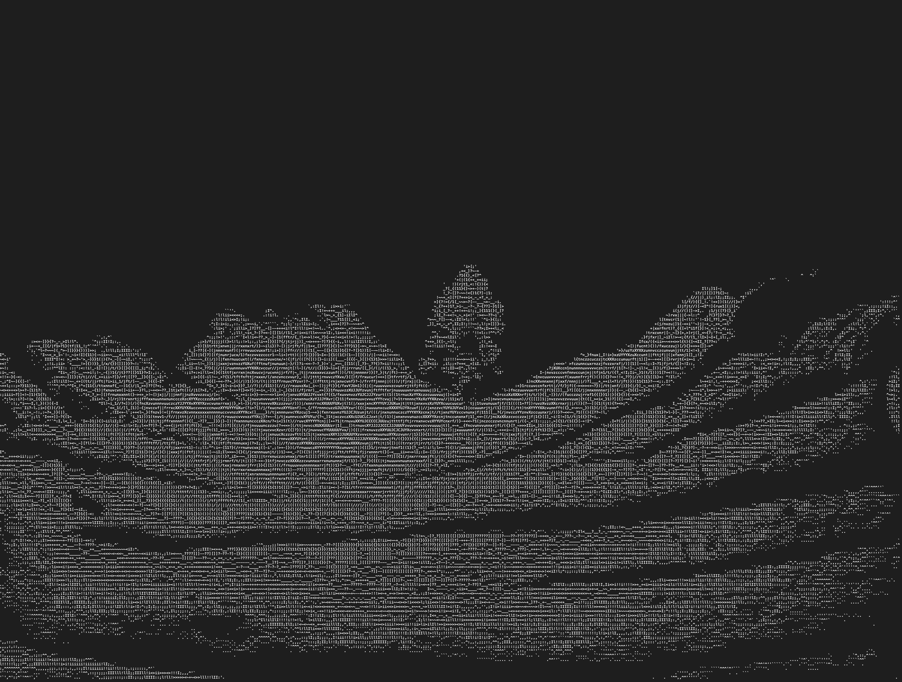
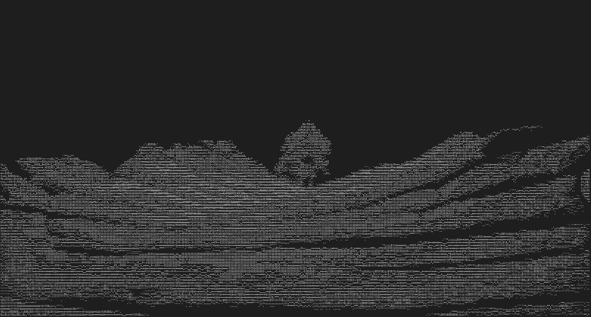
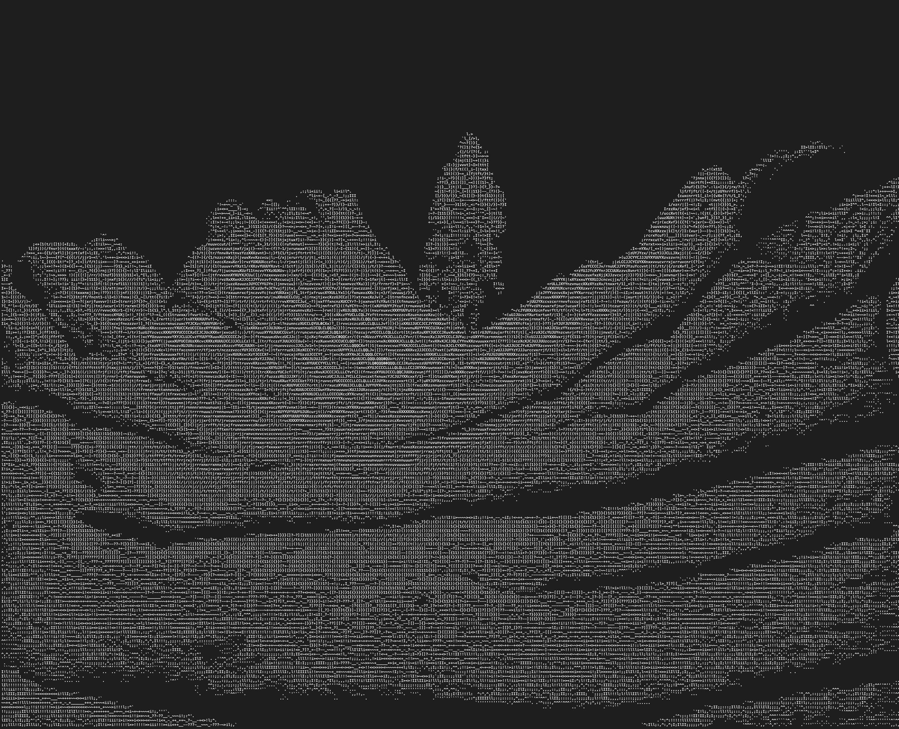

# cascii - Interactive ASCII Frame Generator

`cascii` is a high-performance, interactive tool for converting videos and image sequences into ASCII art frames.

**New:** `cascii` can now be used as both a CLI tool and a Rust library!

When converting a video, the output files will be placed in a directory named after the video file. For example, `cascii my_video.mp4` will create a `my_video` directory.

I recommend installing [cascii-viewer](https://github.com/cascii/cascii-viewer) to easily play any ascii animation generated

## Features

- **Interactive Mode**: If you don't provide arguments, `cascii` will prompt you for them.
- **Flexible Input**: Works with video files or directories of PNGs.
- **Performance**: Uses `ffmpeg` for fast frame extraction and parallel processing with Rayon for ASCII conversion.
- **Video Segments**: Specify start and end times to convert only a portion of a video.
- **Presets**: `--small` and `--large` flags for quick quality adjustments.
- **Non-interactive Mode**: Use `--default` to run without prompts, using default values.
- **Library Support**: Use cascii as a dependency in your own Rust projects.

## Installation

### As a CLI Tool

An `install.sh` script is provided to build and install `cascii` to `/usr/local/bin`.

```bash
# Make sure you are in the cascii directory
./install.sh
```

You will be prompted for your password as it uses `sudo` to copy the binary.

Alternatively, install from crates.io (once published):

```bash
cargo install cascii
```

### As a Library

Add to your `Cargo.toml`:

```toml
[dependencies]
cascii = "0.1"
```

## CLI Usage

### cascii

#### Interactive

Run `cascii` without any arguments to be guided through the process:

```bash
cascii
```

It will first ask you to select an input file from the current directory, then prompt for the output directory, and finally for the quality settings.

#### With Arguments

You can also provide arguments directly:

```bash
# Basic usage with a video file
cascii my_video.mp4 --out ./my_frames

# Using presets
cascii my_video.mp4 --out ./my_frames --large

# Non-interactive mode (will fail if input is not provided)
cascii my_video.mp4 --out ./my_frames --default

# Convert a 5-second clip starting at 10 seconds into the video
cascii my_video.mp4 --start 00:00:10 --end 00:00:15
```

#### Options

- `[input]`: (Optional) The input video file or directory of images.
- `-o`, `--out`: (Optional) The output directory. Defaults to the current directory.
- `--columns`: (Optional) The width of the output ASCII art.
- `--fps`: (Optional) The frames per second to extract from a video.
- `--font-ratio`: (Optional) The aspect ratio of the font used for rendering.
- `--start`: (Optional) The start time for video conversion (e.g., `00:01:23.456` or `83.456`).
- `--end`: (Optional) The end time for video conversion.
- `--default`: Skips all prompts and uses default values for any missing arguments.
- `-s`, `--small`: Uses smaller default values for quality settings.
- `-l`, `--large`: Uses larger default values for quality settings.
- `-h`, `--help`: Shows the help message.
- `-V`, `--version`: Shows the version information.


### Examples:

#### Source image:


#### Test 1:

settings:

````
Luminance: 1
Font Ratio: 0.7
Columns: 400
````


#### Test 2:

settings:

````
Luminance: 35
Font Ratio: 0.7
Columns: 400
````


#### Test 3:

settings:

````
Luminance: 35
Font Ratio: 0.5
Columns: 400
````



#### Test 4:

settings:


````
Luminance: 35
Font Ratio: 1
Columns: 400
````


#### Test animation 1:

Reconstituting a few seconds from the clip [Aleph 2 by Max Cooper](https://www.youtube.com/watch?v=tNYfqklRehM) (around 2:30 to 3:00)

```
Frames: 960
Luminance: 30
Font Ratio: 0.7
Columns: 400
FPS: 30
```


## Library Usage

`cascii` can be used as a Rust library in your own projects.

### Basic Example - Convert an Image to ASCII

```rust
use cascii::{AsciiConverter, ConversionOptions};
use std::path::Path;

fn main() -> Result<(), Box<dyn std::error::Error>> {
    // Create a converter with default configuration
    let converter = AsciiConverter::new();

    // Configure conversion options
    let options = ConversionOptions::default()
        .with_columns(200)
        .with_font_ratio(0.7)
        .with_luminance(20);

    // Convert image to ASCII file
    converter.convert_image(
        Path::new("input.png"),
        Path::new("output.txt"),
        &options
    )?;

    Ok(())
}
```

### Convert Image to String (No File)

```rust
use cascii::{AsciiConverter, ConversionOptions};
use std::path::Path;

fn main() -> Result<(), Box<dyn std::error::Error>> {
    let converter = AsciiConverter::new();
    let options = ConversionOptions::default().with_columns(100);
    
    // Get ASCII as a string without writing to file
    let ascii_string = converter.image_to_string(
        Path::new("input.png"),
        &options
    )?;
    
    println!("{}", ascii_string);
    Ok(())
}
```

### Convert a Video to ASCII Frames

```rust
use cascii::{AsciiConverter, VideoOptions, ConversionOptions};
use std::path::Path;

fn main() -> Result<(), Box<dyn std::error::Error>> {
    let converter = AsciiConverter::new();

    // Video extraction options
    let video_opts = VideoOptions {
        fps: 30,
        start: Some("0".to_string()),
        end: Some("10".to_string()),  // First 10 seconds
        columns: 400,
    };

    // ASCII conversion options
    let conv_opts = ConversionOptions::default()
        .with_font_ratio(0.7)
        .with_luminance(20);

    // Convert video
    converter.convert_video(
        Path::new("video.mp4"),
        Path::new("output_frames/"),
        &video_opts,
        &conv_opts,
        false  // Don't keep intermediate PNG files
    )?;

    Ok(())
}
```

### Using Presets

```rust
use cascii::AsciiConverter;
use std::path::Path;

fn main() -> Result<(), Box<dyn std::error::Error>> {
    let converter = AsciiConverter::new();

    // Use built-in presets: "default", "small", or "large"
    let small_options = converter.options_from_preset("small")?;
    
    converter.convert_image(
        Path::new("input.png"),
        Path::new("output.txt"),
        &small_options
    )?;

    Ok(())
}
```

### API Reference

#### `AsciiConverter`

Main converter struct for ASCII art generation.

**Methods:**
- `new()` - Create converter with default configuration
- `with_config(config: AppConfig)` - Create with custom configuration
- `from_config_file(path: &Path)` - Load configuration from file
- `convert_image(input, output, options)` - Convert image to ASCII file
- `image_to_string(input, options)` - Convert image to ASCII string
- `convert_video(input, output_dir, video_opts, conv_opts, keep_images)` - Convert video to ASCII frames
- `convert_directory(input_dir, output_dir, options, keep_images)` - Convert directory of images
- `get_preset(name)` - Get a preset by name
- `options_from_preset(name)` - Get conversion options from a preset

#### `ConversionOptions`

Options for ASCII conversion.

**Fields:**
- `columns: Option<u32>` - Target width in characters
- `font_ratio: f32` - Font aspect ratio (width/height)
- `luminance: u8` - Luminance threshold (0-255)
- `ascii_chars: String` - ASCII character set (darkest to lightest)

**Methods:**
- `default()` - Create with default options
- `with_columns(columns)` - Set target width
- `with_font_ratio(ratio)` - Set font ratio
- `with_luminance(threshold)` - Set luminance threshold
- `with_ascii_chars(chars)` - Set custom character set

#### `VideoOptions`

Options for video conversion.

**Fields:**
- `fps: u32` - Frames per second to extract
- `start: Option<String>` - Start time (e.g., "00:01:23" or "83")
- `end: Option<String>` - End time
- `columns: u32` - Target width in characters

### Examples

See the `examples/` directory for complete examples:
- `simple_image.rs` - Basic image conversion
- `simple_video.rs` - Video conversion

Run examples with:
```bash
cargo run --example simple_image
cargo run --example simple_video
```

# Sample commands

## Test Image

./target/release/ascii-gen \
  --input ./some_frames_dir \
  --out ../output/sunset_hl \
  --font-ratio 0.7

## Test Video

./target/release/ascii-gen \
  --input ../input.webm \
  --out ../output/sunset_hl \
  --columns 800 \
  --fps 30 \
  --font-ratio 0.7

# Acknowledgements

This project is inspired by [developedbyed's video](https://www.youtube.com/watch?v=dUV8pobjZII) that I recommend watching, I reused the logic from his bash script and rewrote it in rust so that it could process faster files with more details. 
